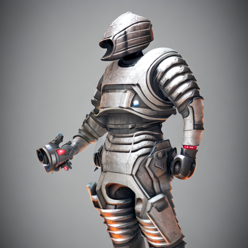
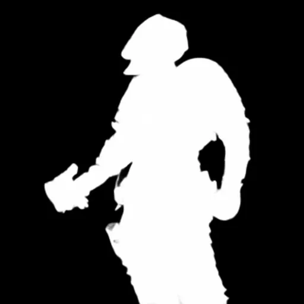
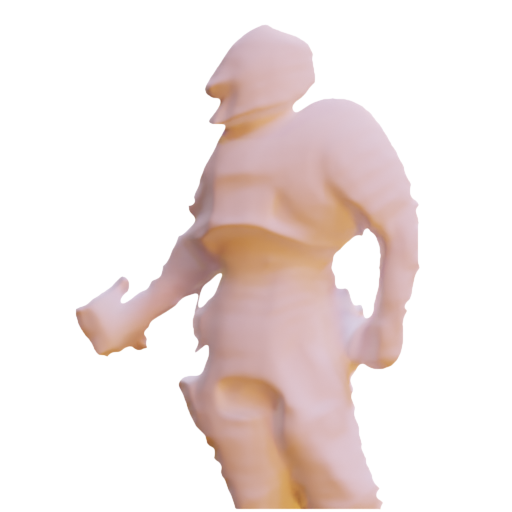
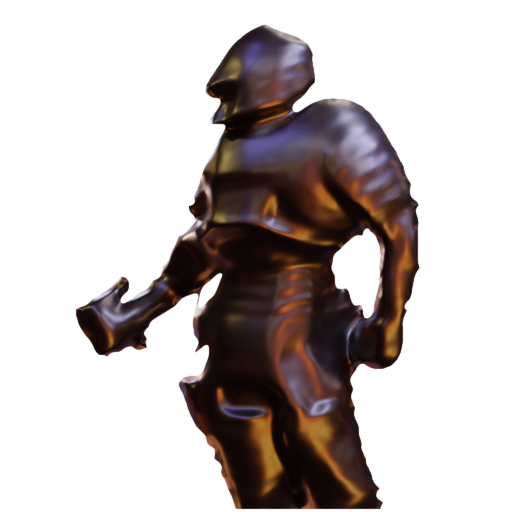

<p align="center">

  <h1 align="center">DiLightNet: Fine-grained Lighting Control for Diffusion-based Image Generation</h1>
  <p align="center">
    <a href="https://www.chong-zeng.com/"><strong>Chong Zeng</strong></a>
    ·
    <a href="https://yuedong.shading.me/"><strong>Yue Dong</strong></a>
    ·
    <a href="https://www.cs.wm.edu/~ppeers/"><strong>Pieter Peers</strong></a>
    ·
    <a href="https://github.com/DQSSSSS"><strong>Youkang Kong</strong></a>
    ·
    <a href="https://svbrdf.github.io/"><strong>Hongzhi Wu</strong></a>
    ·
    <a href="https://scholar.google.com/citations?user=P91a-UQAAAAJ&hl=en"><strong>Xin Tong</strong></a>
  </p>
  <h2 align="center">SIGGRAPH 2024 Conference Proceedings</h2>
  <div align="center">
    
  </div>

  <p align="center">
  <br>
    <a href="https://dilightnet.github.io/"><strong>Project Page</strong></a>
    |
    <a href="https://arxiv.org/abs/2402.11929"><strong>arXiv</strong></a>
    |
    <a href="https://huggingface.co/dilightnet/DiLightNet"><strong>Model</strong></a>
    |
    <a href="https://huggingface.co/spaces/dilightnet/DiLightNet"><strong>Demo</strong></a>
  </p>
</p>

---

DiLightNet is a novel method for exerting ***fine-grained lighting control*** during text-driven diffusion-based image generation. It involves a three stage method for controlling the lighting during image generation: provisional image generation, foreground synthesis and background inpainting. In this repo, we open-source the ControlNet model used in the second stage of DiLightNet, which is a neural network that takes in a provisional image, a mask and radiance hints as input, and geenrates a foreground image under the target lighting. For the provisional image generation stage and background inpainting stage, you can use any off-the-shelf models (e.g. Stable Diffusion, Depth ControlNet, ...) or services (e.g. DALL·E 3, MidJourney, ...).

# Table of Content

* [Environment Setup](#environment-setup)
* [Usage](#usage)
   * [Load the NeuralTextureControlNet Module &amp; Model Weights](#load-the-neuraltexturecontrolnet-module--model-weights)
   * [Inference with StableDiffusionControlNetPipeline Pipeline](#inference-with-stablediffusioncontrolnetpipeline-pipeline)
      * [Input Format](#input-format)
      * [Input/Output Example](#inputoutput-example)
         * [Inputs](#inputs)
         * [Outputs](#outputs)
   * [Integration Examples](#integration-examples)
      * [CLI: video generation with continuous lighting changing](#cli-video-generation-with-continuous-lighting-changing)
         * [Example](#example)
         * [Available arguments](#available-arguments)
         * [Generation Tips](#generation-tips)
      * [Depth Conditioned Generation](#depth-conditioned-generation)
      * [Gradio Demo: single image lighting control](#gradio-demo-single-image-lighting-control)
* [Training](#training)
   * [Data Preparation](#data-preparation)
      * [3D Model ID Lists](#3d-model-id-lists)
      * [Render the Training Images](#render-the-training-images)
      * [Organize the Training Data](#organize-the-training-data)
   * [Launch Training](#launch-training)
* [Community Contributions](#community-contributions)
* [Citation](#citation)

<!-- Created by https://github.com/ekalinin/github-markdown-toc -->


# Environment Setup

We use blender python binding `bpy` for radiance hint rendering. `bpy` requires a minimal version of python 3.10, and for the bpy version (3.6, LTS) we used, the only supported python version is 3.10. Thus, we recommend using `conda` to create a new environment with python 3.10 as well as CUDA and PyTorch dependencies.

```bash
conda create --name dilightnet python=3.10 pytorch torchvision pytorch-cuda=12.1 -c pytorch -c nvidia
conda activate dilightnet
git clone https://github.com/iamNCJ/DiLightNet
cd DiLightNet
pip install -r requirements.txt
```

# Usage

## Load the `NeuralTextureControlNet` Module & Model Weights

```python
from diffusers.utils import get_class_from_dynamic_module
NeuralTextureControlNetModel = get_class_from_dynamic_module(
    "dilightnet/model_helpers",
    "neuraltexture_controlnet.py",
    "NeuralTextureControlNetModel"
)
neuraltexture_controlnet = NeuralTextureControlNetModel.from_pretrained("DiLightNet/DiLightNet")
```

## Inference with `StableDiffusionControlNetPipeline` Pipeline

The base model of DiLightNet is [`stabilityai/stable-diffusion-2-1`](https://huggingface.co/stabilityai/stable-diffusion-2-1), you can easily set up an inference pipeline with our DiLightNet controlnet model.

```python
pipe = StableDiffusionControlNetPipeline.from_pretrained(
    "stabilityai/stable-diffusion-2-1", controlnet=neuraltexture_controlnet,
)
cond_image = torch.randn((1, 16, 512, 512))
image = pipe("some text prompt", image=cond_image).images[0]
```

Please check the simple [example](simple_run.py) for using with real condition images.

### Input Format

The input tensor to the controlnet model should be a `torch.Tensor` of shape `(BS, 16, H, W)`, range `(0, 1)`, where `H` and `W` are the height and width of the image, respectively. The 16 channels are in the order of:

- Provisional Image: `torch.Tensor` of shape `(1, 3, H, W)`, range `(0, 1)`
- Mask: `torch.Tensor` of shape `(1, 1, H, W)`, range `(0, 1)`
- Radiance Hints: `torch.Tensor` of shape `(1, 12, H, W)`, in the order of diffuse, specular (r=0.05, r=0.13, r=0.34), range `(0, 1)`

### Input/Output Example

#### Inputs

| **Provisional Image** | **Mask** | **Radiance Hints - Diffuse** |
| --- | --- | --- |
|  |  |  |
| **Radiance Hints - Specular (r=0.05)** | **Radiance Hints - Specular (r=0.13)** | **Radiance Hints - Specular (r=0.34)** |
|  |  |  |

#### Outputs

| **Output Image** |
| --- |
|  |

## Integration Examples

> Note: We have switched to [DUSt3R](https://dust3r.europe.naverlabs.com/) for mono metric depth estimation and camera intrinsics estimation. The results in the paper are produced with [ZoeDepth](https://github.com/isl-org/ZoeDepth) and a fixed camera intrinsics (fov=55.0). Hence the released version should be better but can produce results slightly different from the paper.

### CLI: video generation with continuous lighting changing

#### Example

```bash
python3 infer_img.py --prov_img examples/provisional_img/futuristic_soldier.png --prompt "futuristic soldier with advanced armor weaponry and helmet" --env_map examples/env_map/grace.exr --out_vid ./output/soldier_grace.mp4
```

Please check the [test script](test.sh) for more examples.

#### Available arguments

```text
--prov_img str         Path to the provisional image (default: None)
--prompt str          Prompt for the generated images (default: )
--num_imgs_per_prompt int
                      Number of images to generate per prompt (default: 4)
--out_vid [str]       Path to the output video, defaults to the input image path (default: None)
--seed int            Seed for the generation (default: 3407)
--steps int           Number of steps for the diffusion process (default: 20)
--cfg float           CFG for the diffusion process (default: 3.0)
--fov [float]         Field of view for the mesh reconstruction, none for auto estimation from the image (default: None)
--mask_path [str]     Path to the mask for the image (default: None)
--use_sam bool, --nouse_sam bool
                      Use SAM for background removal (default: True)
--mask_threshold float
                      Mask threshold for foreground object extraction (default: 25.0)
--pl_pos_r float      Rotation radius of the point light (default: 5.0)
--pl_pos_h float      Height of the point light (default: 3.0)
--power float         Power of the point light (default: 1200.0)
--inpaint bool, --noinpaint bool
                      Inpaint the background of generated point light images (default: False)
--env_map [str]       Environment map for the rendering, defaults to None (white point light) (default: None)
--frames int          Number of frames for lighting controlled video (default: 120)
--use_gpu_for_rendering bool, --nouse_gpu_for_rendering bool
                      Use GPU for radiance hints rendering (default: True)
--cache_radiance_hints bool, --nocache_radiance_hints bool
                      Cache the radiance hints for the video (default: True)
--radiance_hints_path [str]
                      pre-rendered radiance hint path (default: None)
```

#### Generation Tips

1. Foreground mask: By default we use U2Net to generate an inital mask and use SAM to further refine it. But if it doesn't work well on your image, you can provide a mask image with `--mask_path`. The mask image can be RGBA or grayscale, which we directly use the last channel as the mask.
2. Background inpainting: For environment map lightings, the script will automatically inpaint the background with the background color of the environment map. For point light lightings, you can use `--inpaint` to inpaint the background of the generated images using the [stable diffusion inpainting model](https://huggingface.co/stabilityai/stable-diffusion-2-inpainting), but we suggest a manual intervention to get better inpainting results.
3. Randomness: Due to the ambiguity in the provisional image (e.g. shape, original lighting, fine-grained material properties, etc.), generated results can and ***should*** have diversity. Hence, you can try different seeds and prompts to get the wanted results, just as any diffusion model. The script will generate `num_imgs_per_prompt` (default=4) images for each prompt.

### Depth Conditioned Generation

If you have the mesh of an object, you can use the mesh to render finer radiance hints, and use a depth-conditioned diffusion model to generate the provisional image. We provide a simple script to render radiance hints and groud-truth depth map with a mesh:

```bash
python3 mesh_to_hints.py --mesh_path examples/mesh/chair.glb --output_dir tmp/chair --cam_azi 150 --env_map examples/env_map/garage.exr --cam_elev 20
```

Generating a provisional image with the depth conditioned model is also easy with off-the-shelf models like [SDXL Depth ControlNet](https://huggingface.co/diffusers/controlnet-depth-sdxl-1.0):

```python
import cv2
import torch
from diffusers import ControlNetModel, StableDiffusionXLControlNetPipeline

controlnet = ControlNetModel.from_pretrained(
    "diffusers/controlnet-depth-sdxl-1.0",
    torch_dtype=torch.float16,
)
pipe = StableDiffusionXLControlNetPipeline.from_pretrained(
    "stabilityai/stable-diffusion-xl-base-1.0",
    controlnet=controlnet,
    torch_dtype=torch.float16,
).to("cuda")

# convert metric depth to inverse relative depth
depth = imageio.v3.imread('tmp/chair/depth0001.exr')
depth = cv2.resize(depth, (1024, 1024), interpolation=cv2.INTER_NEAREST)[None]
inv_depth = 1.0 / depth
max_depth = inv_depth.max()
min_depth = inv_depth.min()
inv_depth = (inv_depth - min_depth) / (max_depth - min_depth)

# you may want to tune your prompt and other parameters to get the desired results
images = pipe(
    "a wooden chair", image=inv_depth, num_inference_steps=30, controlnet_conditioning_scale=0.5,
).images[0]
```

Then you can use the rendered radiance hints to generate the final video:

```bash
python3 infer_img.py --prov_img examples/depth_cond/prov_imgs/chair_0.png --radiance_hints_path ./tmp/chair/ --prompt "a wooden chair" --out_vid output/chair_0.mp4
```

Note that the provided render scripts is a simplified version, and you can develop a more sophisticated pipeline to render the radiance hints with more complex camera / lighting conditions. For more examples, please refer to the [test script](test.sh).

### Gradio Demo: single image lighting control

```bash
python3 gradio_app.py
```

An online version of this demo can be found on our [huggingface space](https://huggingface.co/spaces/dilightnet/DiLightNet).


# Training

## Data Preparation

Due to the massive size of the training data and the numerous small files it comprises, we can only release the lists of the 3D models and the scripts we used to generate the training data.

### 3D Model ID Lists

All the 3D models in our training data are selected from Objaverse-LVIS. It contains 3 categories of 3D models with a total of 25K models:

1. [Filtered 3D models with PBR (13K)](data_gen/assets/objaverse_fids/filtered_fids.txt): these models have PBR materials and are directly used to generate the training data.
2. [Randomly selected 3D models with albedo only (2K * 2)](data_gen/assets/objaverse_fids/picked_albedo_fids.txt): these models only have a diffuse texture, we randomly pick one from each LVIS category and apply 2 homogeneous specular component (one more metallic and one less metallic) to them for specular material augmentation.
3. [Most liked 3D models (1K * 8)](data_gen/assets/objaverse_fids/picked_homo_fids.txt): these models are selected based on the number of likes provided by the Objaverse. For each object, we apply 4 randomly selected SVBRDF from the [INRIA-Highres SVBRDF dataset](https://team.inria.fr/graphdeco/projects/large-scale-materials/) and 4 randomly sampled homogeneous material (two more metallic and two less metallic).

Furthermore, we provide the object ids of our [test set](data_gen/assets/objaverse_fids/test_fids.txt). These objects are manually selected in Objaverse (without LVIS tags) and all of them contains high-quality PBR material.

### Render the Training Images

We provide a simplified [example rendering script](data_gen/render_3dmodels.py) without infrastructure-specific dependencies or optimizations. For each 3D model, the script will render images under the following lighting conditions:

1. white point lighting
2. multi white point lighting
3. area lighting
4. white environmental lighting (keeping only intensity)
5. environmental lighting

> Note: To avoid lighting and material ambiguity, only 1-4 will serve as the provisional images during training.

The generated file structure should look like below, with mesh normalization info, c2w for each view, lighting condition in each case:
```text
.
├── normalize.json
├── view_0
│   ├── cam.json
│   ├── rgb_for_depth.png
│   ├── env_0
│   │   ├── env.json
│   │   ├── gt_diffuse.png
│   │   ├── gt_ggx0.34.png
│   │   ├── gt_ggx0.13.png
│   │   ├── gt_ggx0.05.png
│   │   └── gt.png
│   ├── env_1
│   │   └── ...
│   ├── white_env_0
│   │   └── ...
│   ├── white_env_1
│   │   └── ...
│   ├── white_pl_0
│   │   └── ...
│   ├── white_pl_1
│   │   └── ...
│   ├── multi_pl_0
│   │   └── ...
│   ├── multi_pl_1
│   │   └── ...
│   ├── area_0
│   │   └── ...
│   └── area_1
│       └── ...
├── view_1
│   └── ...
└── view_2
    └── ...
```

The number of views and each lighting condition for each object can be set in the script.

### Organize the Training Data

This would form a jsonl file, wich each line being a json object with the following fields:
- image: the path to the target image
- hint: [path1, path2, ...]
- ref: [path1, path2, ...], all possible provisional images (exclude itself)
- text: prompt, generated with [BLIP2](https://huggingface.co/Salesforce/blip2-opt-2.7b) using brightened `rgb_for_depth.png`

```json
{
  "image": "/absolute/path/to/your/file/view_0/white_pl_0/gt.png",
  "hint": [
    "/absolute/path/to/your/file/view_0/white_pl_0/gt_diffuse.png",
    "/absolute/path/to/your/file/view_0/white_pl_0/gt_ggx0.05.png"
    "/absolute/path/to/your/file/view_0/white_pl_0/gt_ggx0.13.png"
    "/absolute/path/to/your/file/view_0/white_pl_0/gt_ggx0.34.png"
  ],
  "ref": [
    "/absolute/path/to/your/file/view_0/white_pl_1/gt.png",
    "/absolute/path/to/your/file/view_0/env_0/gt.png",
    "/absolute/path/to/your/file/view_0/env_1/gt.png",
    "..."
  ],
  "text": "some text description generated by BLIP2"
}
```

## Launch Training

We used `fp16` and [`8-bit adam`](https://github.com/TimDettmers/bitsandbytes) to speed up the training process. `bf16` sometimes cause numerical instability, leading to training collapse in our experiments. We use `wandb` to log the training process and logging to `tensorboard` is not tested. Additional dependencies for training are listed in [train/requirements.txt](./train/requirements.txt).

To launch the training process, you can use the following command:

```bash
accelerate launch --mixed_precision="fp16" --multi_gpu train_controlnet.py
  --pretrained_model_name_or_path="stabilityai/stable-diffusion-2-1"
  --output_dir=/path/to/output_dir
  --exp_id="exp_id"
  --dataset_name="/path/to/your/jsonl/data.jsonl"
  --aug_dataset_name="/path/to/your/jsonl/data.jsonl"
  --test_dataset_name="/path/to/your/jsonl/data.jsonl"
  --resolution=512
  --shading_hint_channels=12
  --learning_rate=1e-5
  --train_batch_size=8
  --add_mask
  --mask_weight=0.2
  --dataloader_num_workers=24
  --report_to=wandb
  --checkpointing_steps=500
  --validation_steps=5000
  --max_train_steps=300000
  --proportion_empty_prompts=0.5
  --proportion_channel_aug=0.2
  --proportion_pred_normal=0.1
  --gradient_checkpointing
  --gradient_accumulation_steps=1
  --use_8bit_adam
  --mixed_precision fp16
  --set_grads_to_none
  --resume_from_checkpoint=latest
```

# Community Contributions

We welcome all kinds of contributions to this project, including but not limited to:
- interesting usage examples
- improved image generation pipeline, e.g. better sampling strategies
- integrating DiLightNet into AUTOMATIC1111 or ComfyUI
- adaptation to community models
- community versions of the controlnet model, e.g. dedicated support for portrait images or anime characters
- ...

Please feel free to open an issue or submit a pull request!

# Citation

If you find our work useful in your research, please consider citing:

```bibtex
@inproceedings {zeng2024dilightnet,
    title      = {DiLightNet: Fine-grained Lighting Control for Diffusion-based Image Generation},
    author     = {Chong Zeng and Yue Dong and Pieter Peers and Youkang Kong and Hongzhi Wu and Xin Tong},
    booktitle  = {ACM SIGGRAPH 2024 Conference Proceedings},
    year       = {2024}
}
```
